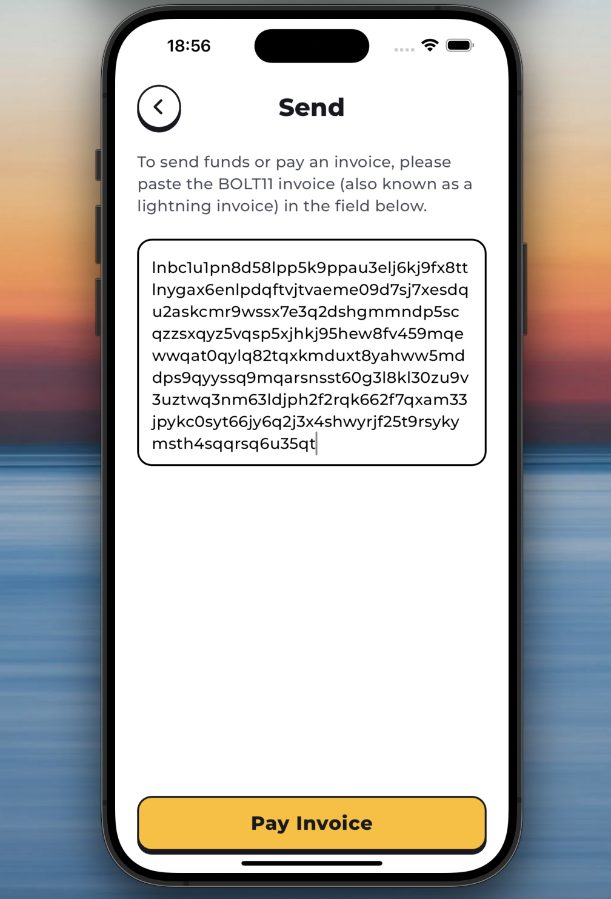

# Tutorial: How to Develop a Nostr Wallet Connect Mobile App Using Flutter and NWC

Hello everyone! My name is Aniket (aka Anipy) and in this tutorial, I'm going to show you how to develop a Nostr Wallet Connect mobile app using Flutter and the [NWC Dart package](https://pub.dev/packages/nwc). Before we dive into the tutorial, it's important to familiarize yourself with the [NIP47](https://github.com/nostr-protocol/nips/blob/master/47.md) protocol to better understand Nostr Wallet Connect.

In brief, Nostr Wallet Connect (NWC) is a protocol that allows applications to access a remote Lightning wallet. Imagine you’ve developed a simple multiplayer game like tic-tac-toe. Your game works great, but you want to add real-world rewards using satoshis (sats). One way to achieve this is by using Nostr Wallet Connect.

With NWC, users can connect their remote Lightning wallets to your app. Now, your tic-tac-toe game can interact with these wallets. Once the connection is established, your game can request payments from the user’s Lightning wallet.

Here’s a practical example: before starting a game, both players agree that the loser will pay an LN invoice to the winner. At the end of the game, your app will automatically create an LN invoice for the winner’s connected wallet and pay it from the loser’s connected wallet. This rewarding mechanism is made possible by NWC.

NWC allows users to connect their remote Lightning wallets to your app easily, ensuring their wallets are available when needed. If a user ever wants to disable this connection, they can simply disconnect it.

Let's get started on building this exciting functionality into your Flutter app!

## Getting Started
Before we dive into coding, let's start by grabbing the "**starter**" project for this tutorial. Open your terminal and run the following command:

```shell
git clone -b starter --single-branch https://github.com/aniketambore/nostr_pay
```

This command will clone the **starter** project, saving you time and allowing you to focus on the exciting parts of this tutorial.

Feeling the excitement? Great! Now, fire up your favorite code editor, whether it’s VS Code or Android Studio.

You may see some errors in the **starter** project initially. To fix this, head over to the `pubspec.yaml` file and locate the `# TODO: Add NWC package here` comment. Replace it with the following:

```yaml
dependencies:
  nwc: ^1.0.1
```

Next, run `flutter pub get` to set things up, and then launch the app. At this stage, it’s a straightforward UI project, but we’ll soon infuse it with some Nostr Wallet Connect magic.


## Project Files
The **starter** project includes several files to help you out. Let’s take a brief tour of these files to understand their purpose before we dive into developing the Nostr Wallet Connect functionality.

### Assets folder
Inside the **assets** directory, you'll find icons, images, and lottie files that will be used to build this app.


### Folder structure
In the **lib** directory, you'll notice various folders, each serving a specific purpose:


#### State Management (BLoC)
In `lib/bloc`, you'll find files for state and credentials management. We’ll discuss these further in the article.

#### Component Library Folder
The `lib/component_library` contains all the reusable UI components that might be used across different screens.

#### Handlers
The `lib/handlers` directory currently contains the `PaymentResultHandler`, which listens to a stream and performs navigation actions based on the received payment results.

#### Models
In `lib/models`, you’ll find the model objects used in our app, defining how data is structured and managed.

#### Routes
The `lib/routes` directory contains all the screens and dialogs displayed in the app.

#### Services
The `lib/services` directory includes services like:

- `Device`: Provides methods to copy text to the clipboard and share text using the device's functionality.
- `Keychain`: Provides methods to securely store, retrieve, and delete key-value pairs in secure storage.

## App Libraries
The **starter** project comes with a set of useful libraries listed in `pubspec.yaml`:

```yaml
dependencies:
  nwc: ^1.0.1
  flutter_bloc: ^8.1.5
  flutter_secure_storage: ^4.2.1
  flutter_svg: ^2.0.10+1
  hydrated_bloc: ^9.1.5
  connectivity_plus: ^6.0.3
  path: ^1.9.0
  path_provider: ^2.1.3
  rxdart: ^0.27.7
  flutter_fgbg: ^0.3.0
  intl: ^0.19.0
  qr_flutter: ^4.1.0
  share_plus: ^9.0.0
  toastification: ^2.0.0
  bolt11_decoder: ^1.0.2
  auto_size_text: ^3.0.0
  lottie: ^3.1.2
  flutter:
    sdk: flutter
```

Here's what they help you to do:

- `nwc`: Simplifies the integration of Nostr Wallet Connect by providing methods for handling NWC-related functionalities.
- `flutter_bloc`: Implements the BLoC (Business Logic Component) design pattern for state management, separating presentation and business logic.
- `flutter_secure_storage`: Securely stores key-value pairs, useful for sensitive data.
- `flutter_svg`: Renders SVG images.
- `hydrated_bloc`: Enhances `flutter_bloc` by persisting state to disk and restoring it.
- `connectivity_plus`: Checks network connectivity status.
- `path`: Provides utilities for working with file and directory paths.
- `path_provider`: Helps access the file system path on the device.
- `rxdart`: Extends Dart's Streams with reactive programming.
- `flutter_fgbg`: Detects when the app moves between the foreground and background.
- `intl`: Supports internationalization and localization.
- `qr_flutter`: Generates QR codes.
- `share_plus`: Provides functionality for sharing content.
- `toastification`: Shows customizable toast notifications.
- `bolt11_decoder`: Decodes Bolt11 payment invoices used in the Lightning Network.
- `auto_size_text`: Automatically resizes text to fit within its bounds.
- `lottie`: Renders lottie animations.

## NWC Initialization
Let's start with initializing the `NWC` class. Open the `main.dart` file and locate `// TODO: Import nwc package`. Replace it with:

```dart
import 'package:nwc/nwc.dart';
```

Next, find `// TODO: Initialize Nostr Wallet Connect class` and replace it along with the nwc variable with:

```dart
final nwc = NWC();
```

Now, open the `lib/bloc/nwc_account/nwc_account_cubit.dart` file, import the NWC package, and locate `// TODO: Instance of the Nostr Wallet Connect class`. Replace it and the `_nwc` variable with:

```dart
final NWC _nwc;
```

Next, locate `// TODO: Change balance controller and stream type to Get_Balance_Result` and replace it and the `_walletBalanceController` and `walletBalanceStream` variables with:

```dart
final BehaviorSubject<Get_Balance_Result?> _walletBalanceController = BehaviorSubject<Get_Balance_Result?>();

Stream<Get_Balance_Result?> get walletBalanceStream => _walletBalanceController.stream;
```

## Monitoring Changes
We initialized the wallet balance controller and stream types in the previous step. Now, let's use the `walletBalanceStream` to monitor changes in the wallet balance by working on the `_watchAccountChanges()` method.

Locate `// TODO: Update the types to match the actual data type` and replace it with:

```dart
return Rx.combineLatest<Get_Balance_Result?, NWCAccountState>([walletBalanceStream], (values) {
  ...
```

In the above code:
- `Rx.combineLatest`: Emits the latest values from the `walletBalanceStream` whenever it emits a new value.

Next, locate `// TODO: Check if wallet balance result is not null` and replace it with:

```dart
if (values.first != null) {
  // TODO: Assemble and return a new NWCAccountState based on the latest balance result
}
```

In the above code:
- `values`: Holds the latest values from the combined streams, where `values.first` corresponds to the latest value from `walletBalanceStream`.
- We're checking if the first value (representing the latest balance result) is not null.

Now, update the state by locating `// TODO: Assemble and return a new NWCAccountState based on the latest balance result` and replacing it with:

```dart
return assembleNWCAccountState(
  values.first!.balance,
  values.first!.maxAmount ?? 0,
  state,
) ?? state;
```

In the above code:

- `assembleNWCAccountState`: A helper function (located in `lib/bloc/nwc_account/nwc_account_state.dart`) that constructs a new `NWCAccountState` object using the provided `balance`, `maxAmount`, and the current state.

With this, we have completed the `_watchAccountChanges` method, which combines the latest values from the `walletBalanceStream` to monitor changes in the wallet balance. When the balance changes, it constructs a new state using `assembleNWCAccountState` and emits this new state. If the balance is null or no change occurs, it returns the current state, ensuring the app’s state is always up-to-date with the latest balance information.

## Inside the Constructor
The `NWCAccountCubit` constructor initializes the state, sets up listeners, and performs initial actions. Let's work on that in this section.

Locate `// TODO: Listen to account changes and emit updated state` and replace it with:

```dart
// 1
_watchAccountChanges().listen((acc) {
  debugPrint('State changed: $acc');
  // 2
  emit(acc);
});
```

In the above code:
1. `_watchAccountChanges().listen((acc) {...})`: Sets up a listener for the stream returned by `_watchAccountChanges()`. Whenever a new state (`acc`) is emitted by the stream, the callback is executed.
2. `emit(acc);`: Emits the new state, updating the state of the Cubit.

Next, locate `// TODO: Disable unnecessary logs from the logger utils` and replace it with:

```dart
_nwc.loggerUtils.disableLogs();
```

Here, we’re disabling logging from the NWC utility to reduce log noise in the production environment, although you can keep it if desired.

Next, locate `// TODO: Connect if the current state type is not none` and replace it with:

```dart
if (state.type != NWCConnectTypes.none) connect();
```

Here, we check if a NWC wallet is already initialized. If it is, we connect to it; otherwise, we do not.

## Connect
Until now, we haven't talked much about NWC, focusing instead on streams and listeners. Let's now discuss the `connect` method. First, look at the parameters:

```dart
Future connect({
  String? connectionURI,
  bool restored = false,
  NWCConnectTypes? type,
}) async {
  ....
}
```

- `connectionURI`: A string representing the URI used to establish the connection between the remote lightning wallet and our app.
- `restored`: A boolean flag indicating whether the connection is being restored.
- `type`: An optional parameter of type `NWCConnectTypes` (an enum) specifying the type of connection. It has three values: `none`, `nwc`, and `alby`.
   - `none`: No wallet is connected to the app.
   - `nwc`: A wallet is connected, where the user manually copies and pastes the connection URI from the remote lightning wallet into the app.
   - `alby`: The Alby wallet is connected. (This article does not cover the Alby wallet connection.)

Now, locate `// TODO: Parse the Nostr Connect URI` and replace it with:

```dart
final parsedUri = _nwc.nip47.parseNostrConnectUri(connectionURI);
```

This uses the `parseNostrConnectUri(connectionURI)` method to parse the connection URI entered by the user, extracting components such as `secret`, `pubkey`, `relay`, and `lud16`. We will discuss `connectionURI` more in the following sections.

Next, locate `// TODO: Derive the public key from the parsed URI secret` and replace it with:

```dart
final myPubkey = _nwc.keysService.derivePublicKey(privateKey: parsedUri.secret);
```

Here, we use the `derivePublicKey(privateKey: parsedUri.secret)` method to derive the public key (`myPubkey`) from the parsed secret (`parsedUri.secret`).

Next, locate `// TODO: Store the secret using the credentials manager` and replace it with:

```dart
await _credentialsManager.storeSecret(secret: parsedUri.secret);
```

This uses the `_credentialsManager.storeSecret(secret: parsedUri.secret)` method to securely store the parsed secret (private key) using the credentials manager (`_credentialsManager`).

Next, locate `// TODO: Emit the new state with the updated properties` and replace it with:

```dart
emit(state.copyWith(
  type: type,
  walletPubkey: parsedUri.pubkey,
  myPubkey: myPubkey,
  relay: parsedUri.relay,
  lud16: parsedUri.lud16,
));
```

This emits a new state using `emit(state.copyWith(...))`, updating the type, `walletPubkey`, `myPubkey`, `relay`, and `lud16` based on the parsed URI components.

So the `connect` method parses the URI to extract necessary parameters, derives the public key from the secret, securely stores the secret, updates the state with connection details, and initialize the connection to enable ongoing communication and synchronization.

## Initializing Relay and Handling Events
Let's move on to the `_initializeConnection()` method. First, locate `// TODO: Initialize the relays service with the relay URL` and replace it with:

```dart
await _nwc.relaysService.init(relaysUrl: [state.relay]);
```

This initializes the `relaysService` provided by `_nwc` with the relay URL obtained from the current state, preparing the NWC to communicate with the specified relay.

Next, locate `// TODO: Create a subscription filter for events` and replace it with:

```dart
final subToFilter = Request(
  filters: [
    Filter(
      kinds: const [23195],
      authors: [state.walletPubkey],
      since: DateTime.now(),
    )
  ],
);
```

This creates a request object with a filter specifying the types of events (`kinds`) and authors (`authors`) to subscribe to. It filters events of kind **23195**, the response event kind in the protocol, authored by the current wallet public key (`state.walletPubkey`).

Next, locate `// TODO: Start the events subscription using the relays service` and replace it with:

```dart
final nostrStream = _nwc.relaysService.startEventsSubscription(
  request: subToFilter,
  onEose: (relay, eose) =>
    debugPrint('subscriptionId: ${eose.subscriptionId}, relay: $relay'),
);
```

This initiates a subscription (`startEventsSubscription`) to the Nostr relay service (`_nwc.relaysService`) based on the defined filter request. It listens for specific events matching the filter criteria (`Filter`).

Next, locate `// TODO: Restore the secret from the credentials manager` and replace it with:

```dart
final secret = await _credentialsManager.restoreSecret();
```

This restores the secret (private key) associated with the wallet from the credentials manager. This secret is necessary for decrypting incoming event content.

Next, locate `// TODO: Listen to the nostr stream for events` and replace it with:

```dart
nostrStream.stream.listen((Event event) {
  // TODO: Event handling logic
});
```

This sets up a listener on the `nostrStream.stream` to listen for incoming events (`Event` objects) from the Nostr relay service. It executes the provided callback whenever a new event is received.

Next, replace `// TODO: Event handling logic` with:

```dart
// 1
if (event.kind == 23195 && event.content != null) {
  // 2
  final decryptedContent = _nwc.nip04.decrypt(
    secret,
    state.walletPubkey,
    event.content!,
  );

  // 3
  final content = _nwc.nip47.parseResponseResult(decryptedContent);

  // 4
  if (content.resultType == NWCResultType.get_balance) {
    // TODO: Handle get_balance result
  } else if (content.resultType == NWCResultType.make_invoice) {
    // TODO: Handle make_invoice result
  } else if (content.resultType == NWCResultType.pay_invoice) {
    // TODO: Handle pay_invoice result
  } else if (content.resultType == NWCResultType.lookup_invoice) {
    // TODO: Handle lookup_invoice result
  } else if (content.resultType == NWCResultType.error) {
    // TODO: Handle error result
  }
}
```

In this code:

1. We first check if the event that we received has the `kind` equal to **23195** ([the response event kind](https://github.com/nostr-protocol/nips/blob/master/47.md#events)) and ensure the content is not null.
2. As defined in **Nip47**, the content of requests and responses is encrypted with **NIP04**. Therefore, we decrypt the content of the incoming event with the retrieved secret and the wallet public key.
3. We parse the decrypted content to determine the type of result (`NWCResultType`) contained in the event.
4. Finally, we handle different types of results (`get_balance`, `make_invoice`, `pay_invoice`, `lookup_invoice`, `error`) and update the state accordingly.

Up to this point, we have set up subscriptions to receive specific events, decrypt incoming event content, handle different types of results (such as balance updates, invoice creation or payment, lookup results, and errors), and update the app state accordingly. We will cover event handling in the following section.

## Publishing Events to Relays
We'll now work on the `_sentToRelay` method, which is responsible for encrypting a given message, creating an event, and sending it to the Nostr relay. Let's break down each part of this method.

First, locate `// TODO: Restore the secret from the credentials manager` and replace it with:

```dart
final secret = await _credentialsManager.restoreSecret();
```

We've covered this in previous sections, so you already understand its purpose.

Next, locate `// TODO: Encrypt the message using NIP04` and replace it with:

```dart
final content = _nwc.nip04.encrypt(
  secret,
  state.walletPubkey,
  jsonEncode(message),
);
```

This encrypts the `message` content using the **NIP04** encryption method provided. It uses the retrieved secret (private key) and the wallet public key to encrypt the JSON-encoded message.

Next, locate `// TODO: Create an event request with the encrypted content` and replace it with:

```dart
final request = Event.fromPartialData(
  kind: 23194,
  content: content,
  tags: [
    ['p', state.walletPubkey]
  ],
  createdAt: DateTime.now(),
  keyPairs: KeyPairs(private: secret),
);
```

This constructs an Event object (request) using the encrypted content. It assigns a kind (**23194** for a request, [as defined in the NIP47 protocol](https://github.com/nostr-protocol/nips/blob/master/47.md#events)), attaches tags (like `['p', state.walletPubkey]`), specifies the creation time (`DateTime.now()`), and includes the `KeyPairs` for encryption (with the private key).

Finally, locate `// TODO: Send the event to relays with a timeout` and replace it with:

```dart
await _nwc.relaysService.sendEventToRelays(
  request,
  timeout: const Duration(seconds: 3),
);
```

This sends the constructed request (`Event` object) to the Nostr relays.

So the `_sentToRelay` method encapsulates the process of encrypting a message, constructing an Event request object with encrypted content, and sending it to the Nostr relays through the NWC. This functionality is crucial for interacting securely with the Nostr network, facilitating actions like making payments, creating invoices, and receiving updates, while maintaining the privacy and integrity of the transmitted data.

## Connecting a Lightning Wallet
Let's run the project and connect a Lightning wallet. After the splash screen, you'll see a screen where the user needs to paste the connection URI of the Lightning wallet. This screen is located in `lib/routes/initial_walkthrough/initial_walkthrough_page.dart`. Open it and follow these steps:

Locate `// TODO: Access NWCAccountCubit instance from context` and replace it with:

```dart
final cubit = context.read<NWCAccountCubit>();
```

This retrieves the `NWCAccountCubit` instance using `context.read`.

Next, locate `// TODO: Call the connect method on NWCAccountCubit` and replace it with:

```dart
await cubit.connect(
  connectionURI: connectionURI,
  type: NWCConnectTypes.nwc,
);
```

Here, we're calling `cubit.connect` to initiate the connection process to the user's remote Lightning wallet using the provided `connectionURI` and passing the type as `NWCConnectTypes.nwc`.

Finally, locate `// TODO: Replace the current route with the home screen` and replace it with:

```dart
navigator.pushReplacementNamed('/');
```

If the connection is successful (no exceptions thrown), it navigates to the '/' route, typically replacing the current route with a new one, which is the home page.

## Obtaining the Connection URI
To get the connection URI, use Lightning wallets that support NWC, such as Mutiny and Alby. For this article, we'll use Alby.

1. Go to [NWC by Alby](https://nwc.getalby.com/).
2. Log in with your Alby account.
3. Click on "Connect app" and enter "NWC Test" as the name (you can use any name).
4. Optionally, set a "Monthly budget"; we'll keep it at 100k sats.


5. Click "Next" and then "Copy pairing secret".


The connection URI will look something like this:
```text
nostr+walletconnect://69effe7b49a6dd5cf525bd0905917a5005ffe480b58eeb8e861418cf3ae760d9?relay=wss://relay.getalby.com/v1&secret=f488038d4e52a63e8e6f29a0be46e683c4e08b7550c2d76be9712b7da149a05a&lud16=aniketamborebitcoindev@getalby.com
```

### Understanding the Connection URI
The connection URI generated by the wallet service consists of the following components:
- **Protocol**: The URI begins with `nostr+walletconnect://`, indicating the use of the Nostr Wallet Connect protocol.
- **Base Path (Hex-encoded Pubkey)**: This uniquely identifies the user's wallet within the protocol. It's crucial for establishing a secure connection.
- **Query String Parameters**:
   - `relay`: This parameter is required and specifies the URL of the relay where the wallet service is connected and will listen for events. Multiple relays can be listed.
   - `secret`: Also required, this is a randomly generated 32-byte hex encoded string. It's used by the client to sign events and encrypt payloads when communicating with the wallet service.
   - `lud16`: While optional, it's recommended as a Lightning address that clients can use to automatically set up the lud16 field.


To proceed, let's hot restart your app. Paste the connection URI into the input field and click "Connect".


After connecting, you may notice your balance displayed as 0 sats on the home page, as we haven't yet retrieved it from the wallet. Let's move on to retrieving the balance in the next step.

## Command: get_balance
To get the correct balance of the wallet, go to `lib/bloc/nwc_account/nwc_account_cubit.dart`. Locate `// TODO: Define a message to request balance` and replace it with:

```dart
final balanceMessage = {"method": "get_balance"};
```

This is one of the wallet commands [defined in NIP47 for getting the current balance](https://github.com/nostr-protocol/nips/blob/master/47.md#get_balance) of the user's wallet.

Next, locate `// TODO: Call the _sentToRelay function to send the balance message` and replace it with:

```dart
await _sentToRelay(balanceMessage);
```

Here, we're calling the `_sentToRelay` method with `balanceMessage` as the parameter.

We are now publishing a request event to the relay with the command `get_balance`. When our wallet service receives this event, it will publish the result or response for us. To handle this, locate `// TODO: Handle get_balance result` inside the `_initializeConnection()` method and replace it with:

```dart
if (content.resultType == NWCResultType.get_balance) {
  final balanceResult = content.result as Get_Balance_Result;
  _walletBalanceController.add(balanceResult);
  debugPrint('balance: ${balanceResult.balance}');
}
```

In the above:
- When the `resultType` is `get_balance`, it casts `content.result` to `Get_Balance_Result`.
- It then adds `balanceResult` to `_walletBalanceController`, which is used to stream wallet balance changes.

Now, simply hot restart the application, and you will see the current balance of your Lightning wallet on the home screen.


### Formatting and Refreshing
Let's format the balance shown on the home screen and add a method to refresh it. Go to `lib/routes/home/home_page.dart`. Locate `// TODO: Read NWCAccountCubit instance from context` and replace it with:

```dart
final accountCubit = context.read<NWCAccountCubit>();
```

Next, locate `// TODO: Call the refresh method on accountCubit to refresh data` and replace it with:

```dart
await accountCubit.refresh();
```

The `refresh()` method simply calls the sync method inside `NWCAccountCubit`.

Next, locate `// TODO: Format the balance using the formatBalance method on accountCubit` and replace it with:

```dart
'${accountCubit.formatBalance(state.balance)} sats',
```

This method formats the balance.

Now, hot reload the app, and you will see the changes made to the balance on the home screen. You can also pull to refresh the balance of the wallet.


Next, we'll implement the `make_invoice` functionality.

## Command: make_invoice
Let's head over to `lib/bloc/nwc_account/nwc_account_cubit.dart` and take a look at the `makeInvoice` method which is responsible for creating a new invoice. It takes an amount in satoshis and an optional description as parameters.

Locate `// TODO: Construct the request object for making an invoice` and replace it with:

```dart
final req = {
  "method": "make_invoice",
  "params": {
    "amount": amountInSats * 1000, // value in msats
    "description": desc, // invoice's description, optional
  }
};
```

Here, `req` constructs the [`make_invoice` command defined in NIP47](https://github.com/nostr-protocol/nips/blob/master/47.md#make_invoice):

1. `amount`: The amount in millisatoshis (msats). It converts the provided amount in satoshis to msats by multiplying by 1000.
2. `description`: Optional description for the invoice.

Next, locate `// TODO: Send the request to the relay using _sentToRelay` and replace it with:

```dart
await _sentToRelay(req);
```

This sends the constructed request to the relays using the `_sentToRelay` method.

Now, locate `// TODO: Handle make_invoice result` inside the `_initializeConnection()` method and replace it with:

```dart
else if (content.resultType == NWCResultType.make_invoice) {
  final invoiceResult = content.result as Make_Invoice_Result;
  debugPrint('invoice: ${invoiceResult.invoice}');
  emit(
    state.copyWith(
      resultType: NWCResultType.make_invoice,
      makeInvoiceResult: invoiceResult,
    ),
  );
}
```

Here:
- When `resultType` is `make_invoice`, it casts `content.result` to `Make_Invoice_Result`.
- It emits a new state with `makeInvoiceResult` to notify listeners about the newly created invoice.

Now, head over to `lib/routes/create_invoice/create_invoice_page.dart` and look at the `_createInvoice()` method, responsible for initiating the invoice creation process in `NWCAccountCubit`.

Locate `// TODO: Access NWCAccountCubit instance from context` and replace it with:

```dart
final cubit = context.read<NWCAccountCubit>();
```

This retrieves the `NWCAccountCubit` instance.

Next, locate `// TODO: Call the makeInvoice method on NWCAccountCubit` and replace it with:

```dart
await cubit.makeInvoice(
  amountInSats: int.parse(_amountController.text),
  description: _descriptionController.text,
);
```

Here, `makeInvoice` is called on the cubit with the parsed amount and description from user inputs.

In the `CreateInvoicePage`, when the user clicks on "Create Invoice" and supplies the amount and description, the `makeInvoice` method is invoked. The response handling is done through a listener.

Now, let's move on to handling the response and errors.

### Listener in `create_invoice_page.dart`
The listener reacts to state changes in `NWCAccountCubit`, specifically handling the results of making an invoice or encountering an error.

Locate `// TODO: Handle the case when the result type is 'make_invoice' and the makeInvoiceResult is not null` and replace it with:

```dart
// 1
if (resultType != null &&
    resultType == NWCResultType.make_invoice &&
    state.makeInvoiceResult != null) {
  // 2
  final navigator = Navigator.of(context);
  navigator.popUntil((route) => route.settings.name == "/");

  // 3
  // Navigate to InvoiceQrPage with the makeInvoiceResult.
  navigator.push(
    MaterialPageRoute(
      builder: (context) => InvoiceQrPage(
        makeInvoiceResult: state.makeInvoiceResult!,
      ),
    ),
  );
}
```

In the above code:

1. It checks if `resultType` is `make_invoice` and `makeInvoiceResult` is not null.
2. If conditions are met, it pops routes until the root ("/") route (home screen).
3. Then, it pushes a new route to display `InvoiceQrPage`, passing `makeInvoiceResult` to it.

Next, locate `// TODO: Handle the case when the result type is 'error' and the nwcErrorResponse is not null` and replace it with:

```dart
// 1
else if (resultType == NWCResultType.error &&
    state.nwcErrorResponse != null) {
  // 2
  final errorMessage = state.nwcErrorResponse!.errorMessage;
  // 3
  showToast(
    context,
    title: errorMessage,
    type: ToastificationType.error,
  );
}
```

Here:
1. It checks if `resultType` is error and `nwcErrorResponse` is not null.
2. If conditions are met, it extracts the error message from `nwcErrorResponse`.
3. Displays the error message as a toast notification using `showToast`.

## Handling Errors in `NWCAccountCubit`
We need to handle error results in `NWCAccountCubit`. Head over to `lib/bloc/nwc_account/nwc_account_cubit.dart` and locate `// TODO: Handle error result` and replace it with:

```dart
else if (content.resultType == NWCResultType.error) {
  final error = content.result as NWC_Error_Result;
  debugPrint('error message: ${error.errorMessage}');
  emit(
    state.copyWith(
      resultType: NWCResultType.error,
      nwcErrorResponse: error,
    ),
  );
}
```

Here:

- When `resultType` is error, it casts `content.result` to `NWC_Error_Result`.
- Emits a new state with `nwcErrorResponse` to notify listeners about the encountered error.

Now, hot restart the app. On the home page, click on "Receive", enter the amount and description, and click "Create Invoice". 


After the invoice is generated, you will see the `InvoiceQrPage`.


Currently, if someone pays this invoice, nothing happens. To handle this, we'll look into the `lookup_invoice` command next.

## Command: lookup_invoice
Let's head back to `lib/bloc/nwc_account/nwc_account_cubit.dart` and look at the `lookupInvoice` method responsible for sending a request to check the status of a specific invoice.

Locate `// TODO: Construct the message to lookup the invoice` and replace it with:

```dart
final message = {
  "method": "lookup_invoice",
  "params": {
    "invoice": invoice,
  }
};
```

Here, `message` constructs the [`lookup_invoice` command as defined in NIP47](https://github.com/nostr-protocol/nips/blob/master/47.md#lookup_invoice):
- The `params` key contains a map with the `invoice` to be looked up.

Next, locate `// TODO: Send the lookup request to the relay using _sentToRelay` and replace it with:

```dart
await _sentToRelay(message);
```

This sends the constructed request to the relays using the `_sentToRelay` method.

Now, locate `// TODO: Handle lookup_invoice result` inside the `_initializeConnection()` method and replace it with:

```dart
else if (content.resultType == NWCResultType.lookup_invoice) {
  // 1
  final result = content.result as Lookup_Invoice_Result;

  // 2
  emit(
    state.copyWith(
      resultType: NWCResultType.lookup_invoice,
      lookupInvoiceResult: result,
    ),
  );
}
```

Here:
1. When `resultType` is `lookup_invoice`, it casts `content.result` to `Lookup_Invoice_Result`.
2. Emits a new state with updated `lookupInvoiceResult` to notify listeners about the invoice status.

Next, head over to `lib/routes/invoice_qr/invoice_qr_page.dart`. This page displays a QR code for the generated invoice and periodically checks if the invoice has been paid.

### Inside `_startPolling()` method
Locate `// TODO: Access NWCAccountCubit instance from context` and replace it with:

```dart
final cubit = context.read<NWCAccountCubit>();
```

This retrieves the `NWCAccountCubit` instance.

Next, locate `// TODO: Call the lookupInvoice method on NWCAccountCubit with the invoice ID` and replace it with:

```dart
await cubit.lookupInvoice(widget.makeInvoiceResult.invoice);
```

Here, `lookupInvoice` is called on the cubit with the invoice ID from `widget.makeInvoiceResult`.

### Listener in `invoice_qr_page.dart`
The listener listens for changes in `NWCAccountCubit` state and reacts based on the type of result received.

Locate `// TODO: Handle the case when the result type is 'lookup_invoice' and the result is not null` and replace it with:

```dart
// 1
if (resultType == NWCResultType.lookup_invoice && result != null) {
  // 2
  final isPaid = result.settledAt != null ? true : false;
  if (isPaid) {
    // 3
    final navigator = Navigator.of(context);
    navigator.popUntil((route) => route.settings.name == "/");
    navigator.push(
      MaterialPageRoute(
        builder: (_) => const SuccessPage(
          title: 'Payment Received Successfully',
          description:
              'Congratulations! You have successfully received sats from the sender.',
        ),
      ),
    );
  }
}
```

Here:

1. It checks if `resultType` is `lookup_invoice` and `result` is not null.
2. Checks if `settledAt` field in the result is not null, indicating that the invoice has been paid.
3. If paid, pops routes until root ("/") route and navigates to `SuccessPage` with a success message.

Next, locate `// TODO: Handle the case when the result type is 'error' and the nwcErrorResponse is not null` and replace it with:

```dart
// 1
else if (resultType == NWCResultType.error &&
    state.nwcErrorResponse != null) {
  final errorMessage = state.nwcErrorResponse!.errorMessage;
  // 2
  showToast(
    context,
    title: errorMessage,
    type: ToastificationType.error,
  );
}
```

Here:
1. It checks if `resultType` is error and `nwcErrorResponse` is not null.
2. If conditions are met, it shows a toast notification with the error message.

That completes the `lookup_invoice` command implementation. Now, hot restart the app, create an invoice, and try paying it. You'll see the `lookup_invoice` command in action, navigating to the `SuccessPage` upon successful payment.


We've covered `get_balance`, `make_invoice`, and `lookup_invoice`. Let's proceed to the final command of this article: `pay_invoice`.

## Command: pay_invoice
For the final command, head over to `lib/bloc/nwc_account/nwc_account_cubit.dart` and look at the `payInvoice` method which is responsible for paying a specific invoice provided by the user.

Locate `// TODO: Construct the message to pay the invoice` and replace it with:

```dart
final message = {
  "method": "pay_invoice",
  "params": {
    "invoice": invoice,
  }
};
```

Here, `message` constructs the [`pay_invoice` command as defined in NIP47](https://github.com/nostr-protocol/nips/blob/master/47.md#pay_invoice):
- The `params` key contains a map with the `invoice` to be paid.

Next, locate `// TODO: Send the payment request to the relay using _sentToRelay` and replace it with:

```dart
await _sentToRelay(message);
```

This sends the constructed request to the relays using the `_sentToRelay` method.

Now, locate `// TODO: Handle pay_invoice result` inside the `_initializeConnection()` method and replace it with:

```dart
else if (content.resultType == NWCResultType.pay_invoice) {
  // 1
  final invoiceResult = content.result as Pay_Invoice_Result;
  // 2
  _paymentResultStreamController.add(
    NWCPaymentResult(
      resultType: NWCResultType.pay_invoice,
      payInvoiceResult: invoiceResult,
    ),
  );
  // 3
  emit(
    state.copyWith(
      resultType: NWCResultType.pay_invoice,
      payInvoiceResult: invoiceResult,
    ),
  );
}
```

Here:
1. When `resultType` is `pay_invoice`, it casts `content.result` to `Pay_Invoice_Result`.
2. Adds a new payment result to `_paymentResultStreamController` to stream to listeners.
3. Emits a new state with updated `payInvoiceResult` to reflect the payment operation.

Now, let's integrate this into the UI flow for paying an invoice.

### `PaymentRequestDialog` in `payment_dialogs/payment_request_dialog.dart`
This dialog handles the confirmation of paying an invoice after decoding it. Locate `// TODO: Call the payInvoice method on accountCubit with the invoice bolt11` and replace it with:

```dart
paymentFunc: () => accountCubit.payInvoice(widget.invoice.bolt11),
```

Here:
- `payInvoice` method is called on `accountCubit` with the `bolt11` invoice string from `widget.invoice`.

### Using `payInvoice` in UI Flow
From the home screen, when the user clicks on "Send", they are taken to the `PayInvoicePage`. After pasting the invoice there and clicking on "Pay Invoice" button, the invoice is decoded, and a confirmation dialog (`PaymentRequestDialog`) is shown to the user.

If the user clicks "Yes" in the `PaymentRequestDialog`, the `payInvoice` method we just implemented is called to initiate the payment process.

### Testing the Flow
Hot restart the app. Click on "Send" on the home page, paste an invoice from a different wallet, and click "Pay Invoice". 



In the `PaymentRequestDialog`, click "Yes".


You'll see a `ProcessingPaymentDialog` and after that, a success screen if the payment is successful.


This completes the integration of the `pay_invoice` command. Now you have a complete flow for creating, receiving, and paying invoices using the `NWCAccountCubit` and handling the respective results and errors.

## Conclusion
As we come to the end of our journey exploring Nostr wallet connect, I want to express my heartfelt thanks to the developers and the vibrant community driving innovations in Nostr, NWC, and the Lightning Network space. Your dedication and expertise have made it straightforward for developers like me to integrate Lightning Network capabilities into our apps.

As we continue to explore Lightning Network features in our apps, remember that this technology marks just the beginning of a transformative era in Bitcoin's scalability.

If you have any questions or wish to share your experiences, please feel free to reach out to me on [Twitter](https://twitter.com/Anipy1), [Nostr](https://snort.social/p/npub1clqc0wnk2vk42u35jzhc3emd64c0u4g6y3su4x44g26s8waj2pzskyrp9x), or [LinkedIn](https://www.linkedin.com/in/aniketambore/).

Thank you for joining me on this journey. ⚡🌊  